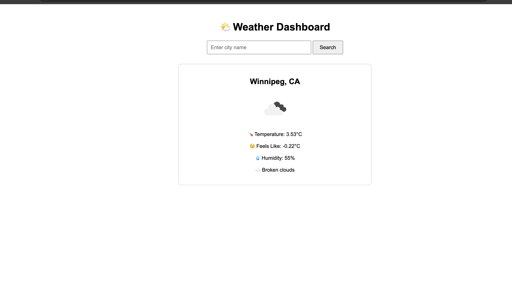

# 🌤️ Weather Dashboard

A web application that displays real-time weather information for any city in the world.

## 🛠️ Tech Stack

- Java
- Spring Boot
- Thymeleaf
- OpenWeatherMap API

## ✨ Features

- Search weather by city name
- Displays temperature and feels like temperature
- Displays humidity percentage
- Displays weather description and icon

## 🚀 How to Run

1. Clone the repository
```bash
   git clone https://github.com/yourusername/weather-dashboard.git
```

2. Add your API key in `src/main/resources/application.properties`
```properties
weather.api.key=48bbbe03467cfdad57feeae7e5bf2484
weather.api.url=https://api.openweathermap.org/data/2.5/weather
```

3. Open the project in IntelliJ and click the green ▶ Run button

4. Open your browser and go to `http://localhost:8080`

## 🔑 API Used

[OpenWeatherMap API](https://openweathermap.org/api) — Free tier, 1000 calls/day

## 📸 Screenshot

# Weather-Dashboard
